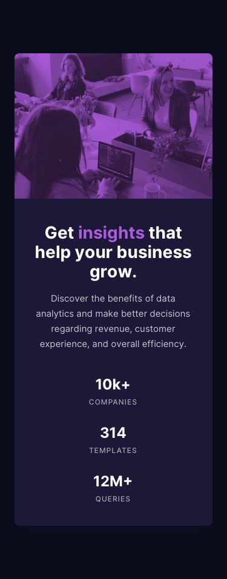

# Stats Preview Card Component
## View the **[Development Site](https://gabeaustin.github.io/redo-stats-preview-card)**

 

This is a PSD design converted into an HTML/CSS template. This template is fully responsive and mobile-friendly.

 

### Technology Used

:heavy_check_mark:&nbsp;&nbsp; HTML  
:heavy_check_mark:&nbsp;&nbsp; CSS  
:heavy_check_mark:&nbsp;&nbsp; Flexbox  

## **To Do**
- [ ] Change footer to only show developer's information

## **Bug(s)**

## **Feature(s)**
- [x] **F.01**: Add images of the finished product to the `README.md` file
- [ ] **F.02**: Add Open Graph data to meta tags

## **Images of the Photoshop Document (PSD)**
**PSD - Desktop View**  

**PSD - Mobile View**  

 

## **Images of the Finished Product**
**HTML - Desktop View**  

**HTML - Mobile View**  

 
 

:octocat:&nbsp;&nbsp;Stats Preview Card Component&nbsp;&nbsp;:octocat:  
:bowtie:&nbsp;&nbsp;A Gabe A. Production&nbsp;&nbsp;:bowtie:
